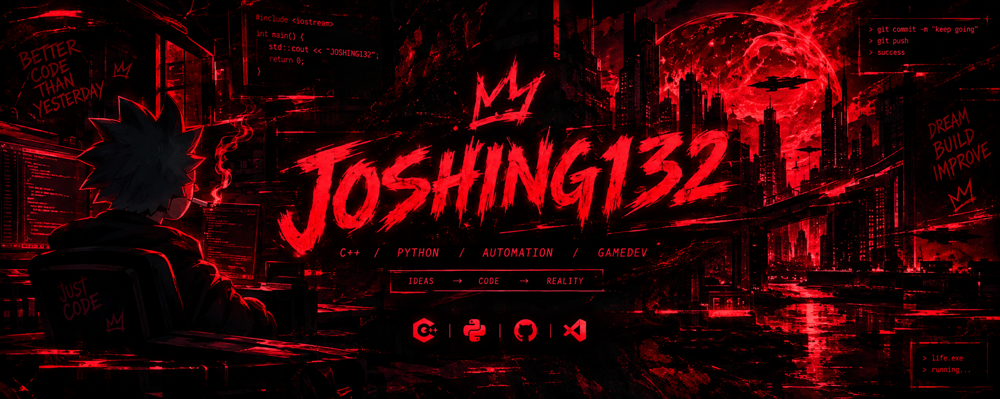

<div align="center">


### Student Developer · C++ & Python

[](https://github.com/JOSHING132)
[](https://t.me/JOSHING132)
[](https://vk.ru/id877040734)



</div>

## 👋 About me

- 🎓 Student at **IT TOP Academy**.
- 💻 Learning and building with **C++** and **Python**.
- 🎮 Interested in game development and software development.
- 🤖 Exploring AI APIs, Telegram bots and local automation.
- 🛠️ Using Git, GitHub, CMake, VS Code and Visual Studio.
- 🚀 Learning through real projects, experiments and open-source code.

## 🔥 Current focus

```text
C++ · Python · Git · GitHub · CMake · Raylib
```

## 🛠️ Technologies & tools

<div align="center">

[](https://skillicons.dev)

</div>

## 🎮 Featured project

### 🏛️ [WithLand](https://github.com/JOSHING132/WithLand) — Fork of [Sharzhukov/WithLand](https://github.com/Sharzhukov/WithLand)

This repository is a fork of the original [WithLand](https://github.com/Sharzhukov/WithLand) project by **Sharzhukov**.

A C++17 colony survival simulator and my main project for learning, experimentation and development.

The project currently includes:

- 👥 Colony and settler management
- ❤️ Health, hunger and mood systems
- 🧑‍🌾 Multiple professions
- 🦠 Diseases, recovery and death conditions
- 📅 Turn-based day-by-day simulation
- 🎒 Inventory with stackable items and food
- 🍎 Food consumption and health restoration
- 🛡️ Initial armor foundation
- 🌲 Tree interaction and wood gathering
- 📜 Events, reports and game logs
- 🖥️ TUI and Raylib-based GUI

The project is actively developed, so some systems are still being expanded.

## 🤖 Python & AI experiments

I also build small Python projects around **Telegram bots, AI APIs, automation and experiments**.

These projects are primarily for learning and exploring practical ways to use Python and AI tools.

## 📊 GitHub statistics

<div align="center">


</div>

## 🔥 Contribution streak

<div align="center">


</div>

## 🐍 Contribution snake

<div align="center">

<picture>
  <source media="(prefers-color-scheme: dark)" srcset="https://raw.githubusercontent.com/JOSHING132/JOSHING132/output/github-contribution-grid-snake-dark.svg">
  <source media="(prefers-color-scheme: light)" srcset="https://raw.githubusercontent.com/JOSHING132/JOSHING132/output/github-contribution-grid-snake.svg">
  
</picture>

</div>

> The snake is generated automatically by GitHub Actions. It will appear after the workflow has completed at least once.

## 📫 Contact

- **Telegram:** [@JOSHING132](https://t.me/JOSHING132)
- **VK:** [Profile](https://vk.ru/id877040734)

---

<div align="center">

### `Learning. Building. Improving. 🚀`

</div>

---

# 🇷🇺 Русская версия

## 👋 Обо мне

- 🎓 Студент **Академии IT TOP**.
- 💻 Изучаю и использую **C++** и **Python**.
- 🎮 Интересуюсь разработкой игр и программного обеспечения.
- 🤖 Изучаю AI API, Telegram-ботов и локальную автоматизацию.
- 🛠️ Работаю с Git, GitHub, CMake, VS Code и Visual Studio.
- 🚀 Развиваюсь через реальные проекты, эксперименты и open-source код.

## 🔥 Сейчас изучаю

```text
C++ · Python · Git · GitHub · CMake · Raylib
```

## 🎮 Основной проект

### 🏛️ [WithLand](https://github.com/JOSHING132/WithLand)

Симулятор выживания колонии на **C++17** и мой основной проект для обучения, экспериментов и разработки.

Сейчас в проекте есть:

- 👥 Управление колонией и поселенцами
- ❤️ Системы здоровья, голода и настроения
- 🧑‍🌾 Несколько профессий
- 🦠 Болезни, восстановление и условия смерти
- 📅 Пошаговая симуляция по дням
- 🎒 Инвентарь со складываемыми предметами и едой
- 🍎 Использование еды и восстановление здоровья
- 🛡️ Начальная основа системы брони
- 🌲 Взаимодействие с деревьями и добыча древесины
- 📜 События, отчёты и игровые логи
- 🖥️ TUI и GUI на базе Raylib

Проект активно развивается, поэтому отдельные системы ещё находятся в процессе расширения.

## 🤖 Python и AI-эксперименты

Также создаю небольшие Python-проекты с **Telegram-ботами, AI API, автоматизацией и экспериментами**.

В основном это проекты для обучения и практического изучения Python и AI-инструментов.

## 📫 Контакты

- **Telegram:** [@JOSHING132](https://t.me/JOSHING132)
- **VK:** [Профиль](https://vk.ru/id877040734)

---

<div align="center">

### `Учусь. Создаю. Развиваюсь. 🚀`

</div>
