<div align="center">


### C++ Developer • Python • Linux • Game Development

<p>
  
  
  
  
  
</p>

<p>
  <a href="https://github.com/JOSHING132">
    
  </a>
  <a href="https://github.com/JOSHING132?tab=repositories">
    
  </a>
</p>

</div>

---

## 🧑‍💻 About Me

```text
┌──────────────────────────────────────────────┐
│                 JOSHING132                   │
├──────────────────────────────────────────────┤
│  💻 C++ / Python                             │
│  🎮 Game Development                         │
│  🐧 Linux                                    │
│  🛠️ CMake / Git                              │
│  🧠 Systems & Simulation                     │
│  🔥 Building things and learning every day   │
└──────────────────────────────────────────────┘
```

I'm a developer focused on **C++**, **Python**, game development and
systems-oriented projects.

I enjoy creating things from scratch, experimenting with mechanics,
working with low-level concepts and turning ideas into playable projects.

---

## ⚡ Tech Stack

### Languages

<p>
  
  
</p>

### Tools & Technologies

<p>
  
  
  
  
  
</p>

---

## 🚀 Featured Project

### 🏛️ [WithLand](https://github.com/JOSHING132/WithLand) — Fork of [Sharzhukov/WithLand](https://github.com/Sharzhukov/WithLand)

A **C++17 turn-based colony survival simulator**.

This repository is a fork of the original [WithLand](https://github.com/Sharzhukov/WithLand) project by **Sharzhukov**.

The project combines survival mechanics, resource management,
random events and colony simulation.

### 🎮 Features

- 👨‍🌾 Multiple professions
- ❤️ Health system
- 🍖 Hunger system
- 😊 Mood system
- 🦠 Diseases and recovery
- 💀 Damage and death mechanics
- 📅 Daily simulation
- 🌲 Wood harvesting
- 🎒 Inventory system
- 🍎 Stackable food
- 🪵 Stackable resources
- 🛡️ Armor system
- ⚔️ Events and random situations
- 📜 Game logs
- 🖥️ TUI interface
- 🎨 Raylib GUI
- 💻 macOS / Linux / Windows

### 👥 Professions

```text
Farmer    🌾
Builder   🔨
Medic     🩺
Scout     🔭
Guard     🛡️
Mage      🔮
```

### 🛠️ Built With

```text
C++17
CMake
Raylib
Git
```

👉 **Check out the project:**

**[github.com/JOSHING132/WithLand](https://github.com/JOSHING132/WithLand)**

---

## 📊 GitHub Statistics

<p align="center">
  
  
</p>

---

## 🐍 Contribution Snake

<p align="center">
  <picture>
    <source
      media="(prefers-color-scheme: dark)"
      srcset="https://raw.githubusercontent.com/JOSHING132/JOSHING132/output/github-contribution-grid-snake-dark.svg"
    >
    <source
      media="(prefers-color-scheme: light)"
      srcset="https://raw.githubusercontent.com/JOSHING132/JOSHING132/output/github-contribution-grid-snake.svg"
    >
    
  </picture>
</p>

---

## 📈 Activity

<p align="center">
  
</p>

---

## 🔥 Currently

```text
> Learning C++
> Building game systems
> Working with Linux
> Improving architecture
> Experimenting with simulations
> Creating new projects
```

---

## 🎯 Goals

- 🚀 Improve C++ skills
- 🎮 Build more complex games
- 🧠 Learn advanced software architecture
- 🐧 Become more comfortable with Linux
- ⚙️ Build efficient systems
- 🔥 Create interesting open-source projects

---

## 📫 Contact

<p align="center">

<a href="https://github.com/JOSHING132">
  
</a>

</p>

---

<div align="center">

```text
╔══════════════════════════════════════════╗
║                                          ║
║              J O S H I N G 1 3 2       ║
║                                          ║
║        Code • Create • Experiment        ║
║                                          ║
╚══════════════════════════════════════════╝
```

**Thanks for visiting my profile! 🔥**

</div>
